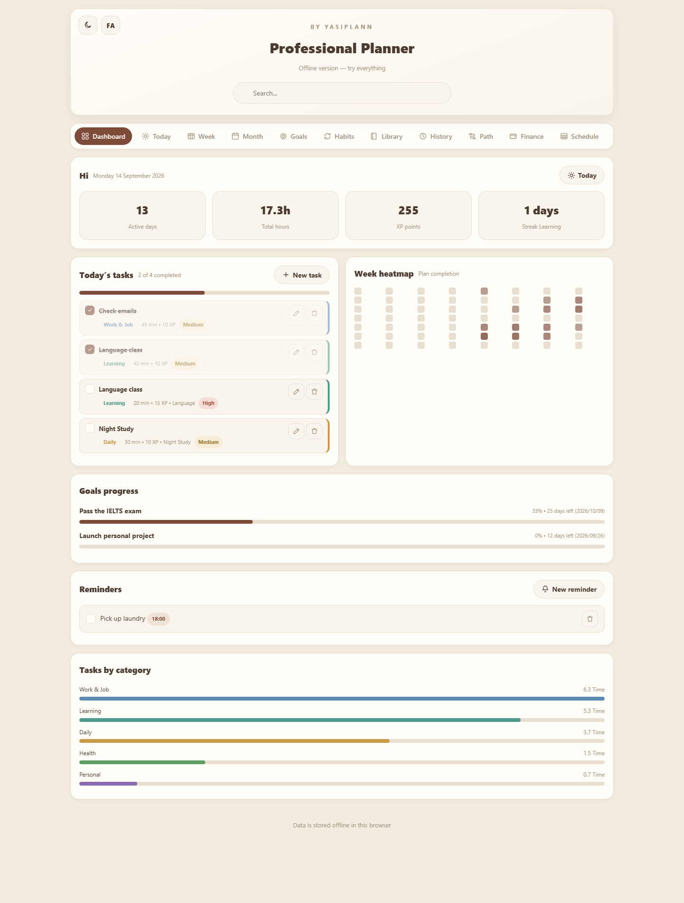
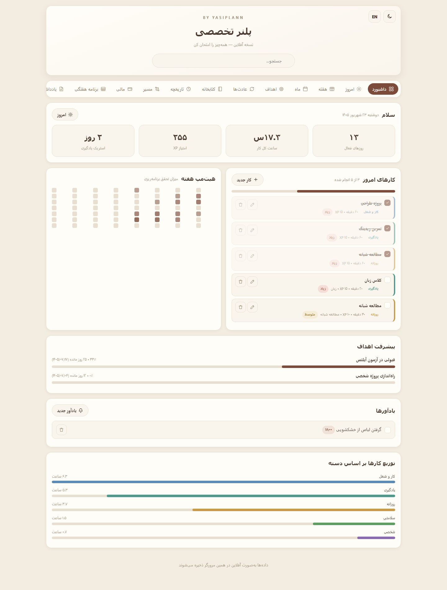
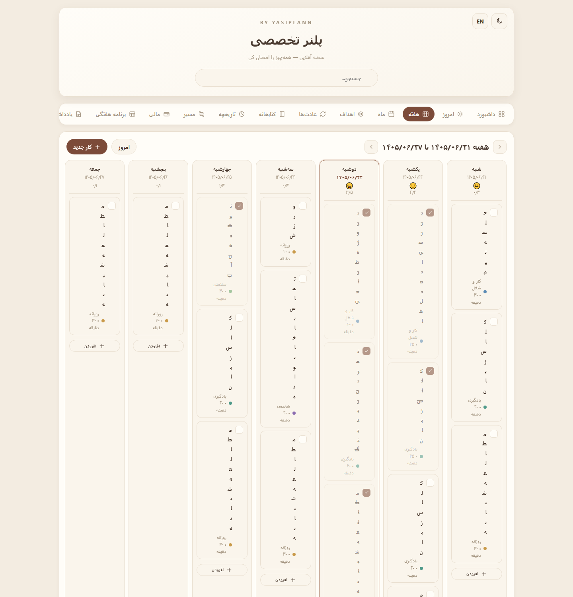
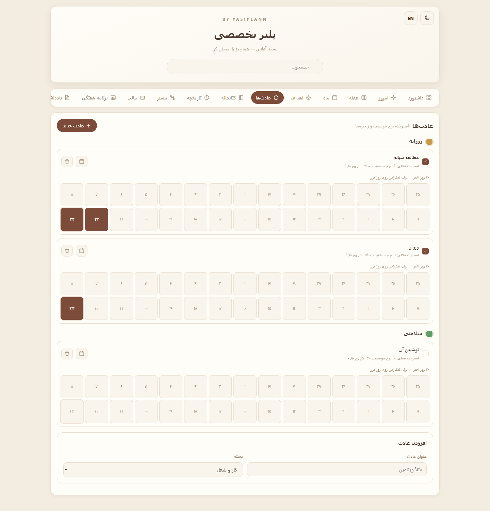
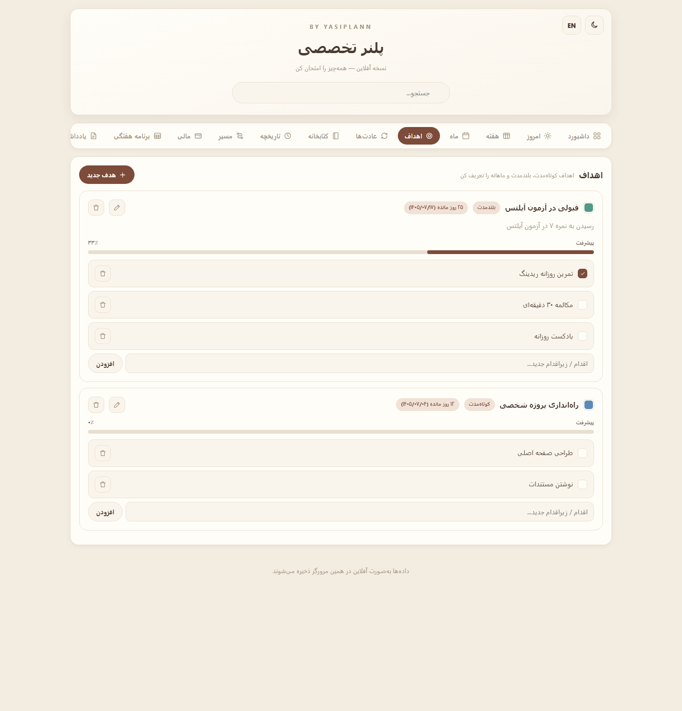
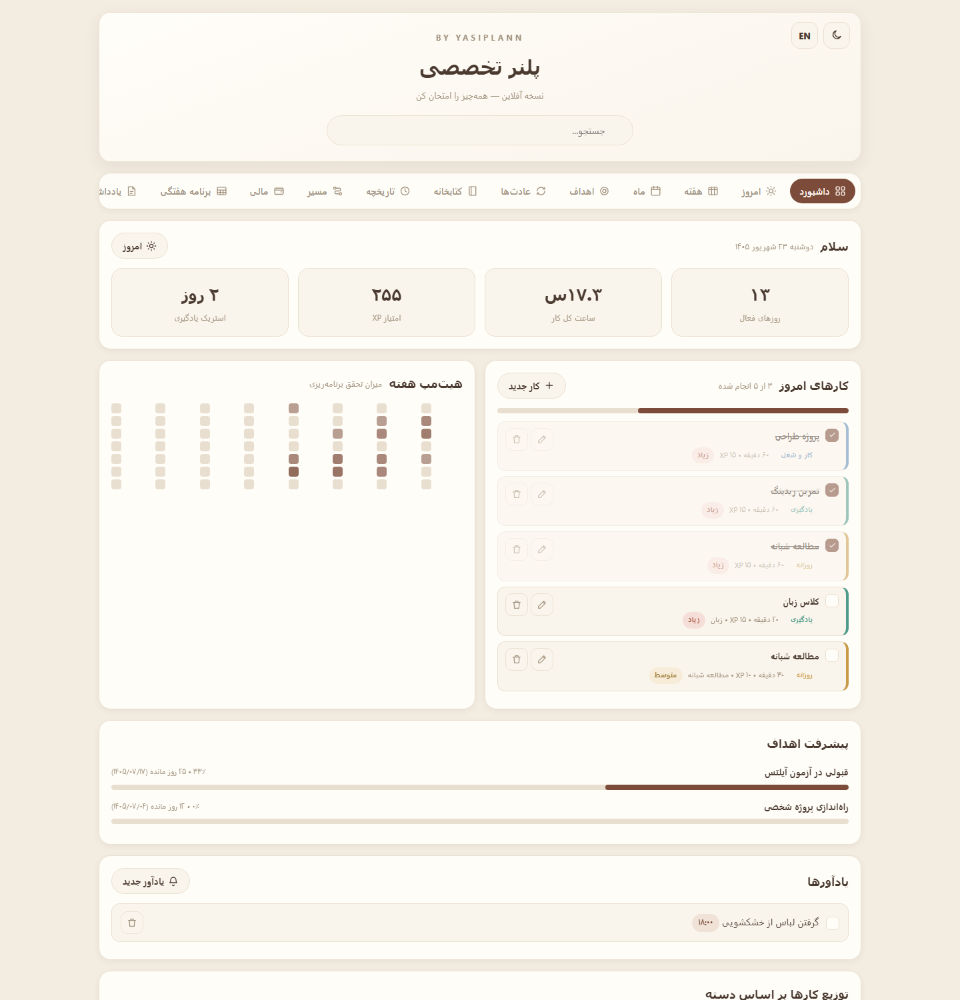
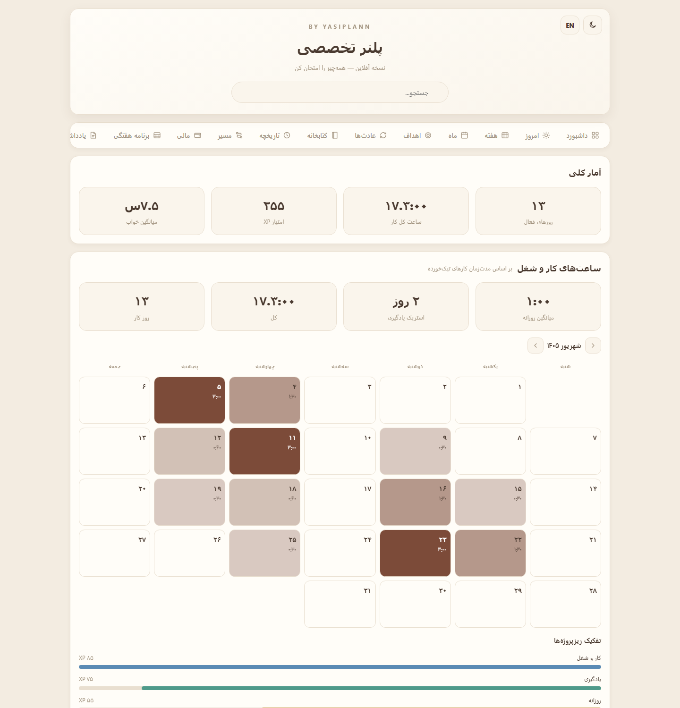
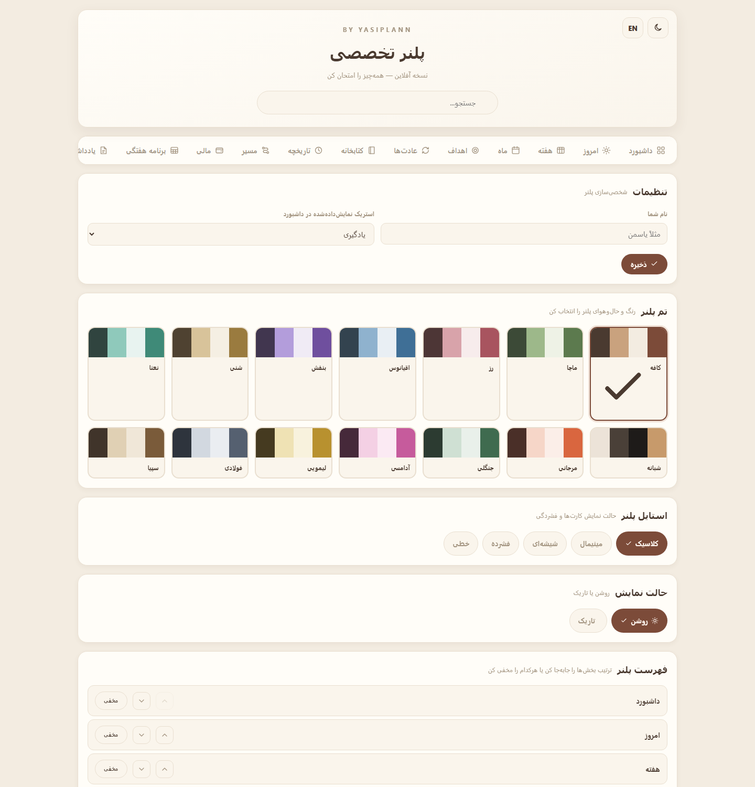

<div align="center">

<!-- ═════════════════ HEADER ═════════════════ -->

# 🗂️ Professional Planner

**A fully offline, bilingual personal planner — with Jalali (Persian) & Gregorian calendars.**
**Zero dependencies · single HTML file · no server · no account.**

[](LICENSE)
[](#-privacy--data)
[](package.json)
[](#-tech-stack)


<br/>



<sub>English dashboard with sample data · <a href="docs/preview.png">Persian version</a></sub>

<br/><br/>

[**🚀 Quick Start**](#-quick-start) &nbsp;·&nbsp;
[**✨ Features**](#-features) &nbsp;·&nbsp;
[**🖼️ Gallery**](#-gallery) &nbsp;·&nbsp;
[**🌐 Bilingual**](#-bilingual) &nbsp;·&nbsp;
[**🛠️ Build**](#-build) &nbsp;·&nbsp;
[**❓ FAQ**](#-faq)

</div>

---

> [!NOTE]
> **No server, no internet, no account, no dependencies.** Open one HTML file and start planning — everything is stored offline in your own browser.

---

## 📑 Table of Contents

- [Features](#-features)
- [Gallery](#-gallery)
- [Quick Start](#-quick-start)
- [Bilingual](#-bilingual)
- [Project Structure](#-project-structure)
- [Build](#-build)
- [Tech Stack](#-tech-stack)
- [Privacy & Data](#-privacy--data)
- [FAQ](#-faq)
- [Contributing](#-contributing--license)

---

## ✨ Features

<table>
<tr>
<td width="50%" valign="top">

**🗓️ Calendar & Language**
- Full **Jalali (Shamsi)** calendar for Persian
- **Gregorian** calendar for English
- **In-page language switch** (RTL ⇄ LTR) with **shared data**
- Week starts Saturday (fa) / Sunday (en)

**📋 Planning**
- Hierarchical categories (category + subcategory)
- Goals with actions, deadlines & progress %
- Daily / weekly / monthly tasks with priority, duration & XP
- Fixed weekly schedule (classes & routine)

</td>
<td width="50%" valign="top">

**🔁 Wellbeing & Mind**
- Habits with streaks & success rate
- **30-day tick grid with dates**
- **Mood tracker** in journal, notes & stats
- Sleep chart & activity heatmap

**💰 And More**
- Finance: income, expenses, budget, debts, 6-month chart
- Library (books / podcasts / movies)
- **14 color themes** · **5 layout styles** · **light/dark**
- Personalized menu (reorder & hide sections)
- JSON backup (export / import)

</td>
</tr>
</table>

---

## 🖼️ Gallery

<div align="center">

### Dashboard
| English | Persian |
|:---:|:---:|
|  |  |

### Sections
| Week | Habits |
|:---:|:---:|
|  |  |

| Goals | Finance |
|:---:|:---:|
|  |  |

| Stats | Settings |
|:---:|:---:|
|  |  |

</div>

---

## 🚀 Quick Start

### ① No server (single file)
Download **`planner-bilingual.html`** and **double-click** it. Done. ✨

### ② Localhost
```bash
git clone https://github.com/panteamkhh/planner-pro.git
cd planner-pro
npm start          # → http://localhost:5173
```
> On Windows, just run **`run.bat`**.

<div align="center">

**🌍 Live demo:** `https://panteamkhh.github.io/planner-pro/`

</div>

---

## 🌐 Bilingual

Click the **`EN / FA`** button in the header to switch language:

| | 🇮🇷 Persian | 🇬🇧 English |
|---|:---:|:---:|
| **Direction** | RTL | LTR |
| **Calendar** | Jalali (Shamsi) | Gregorian |
| **Week starts** | Saturday | Sunday |

> When you switch language, **all saved dates are automatically converted** between the two calendars, so your data stays identical across languages.

---

## 🧱 Project Structure

```text
planner-pro/
├─ index.html                 ← bilingual localhost app
├─ planner-bilingual.html     ← offline single-file build (no server)
├─ css/styles.css             ← 14 themes · 5 styles · dark mode · RTL/LTR
├─ js/
│  ├─ jalali.js               ← Jalali ⇄ Gregorian conversion
│  ├─ gregorian.js            ← Gregorian calendar adapter
│  ├─ app.js                  ← Persian app logic (source of truth)
│  └─ app.en.js               ← generated English app
├─ scripts/
│  ├─ translate.js            ← generates app.en.js from app.js
│  └─ build.js                ← generates planner-bilingual.html
├─ docs/                      ← README screenshots
└─ server.js · run.bat        ← local static server
```

---

## 🛠️ Build

```bash
npm run build      # translate.js + build.js
```

- `scripts/translate.js` generates the English app and **fails if any text is left untranslated**.
- `scripts/build.js` produces the single-file build (CSS/JS inlined).

> To change any wording, edit `js/app.js` and run `npm run build`.

---

## 💻 Tech Stack

<div align="center">


</div>

No frameworks, no build step for the app itself, no runtime dependencies — just plain HTML, CSS and JavaScript.

---

## 🔒 Privacy & Data

Everything lives in your browser's `localStorage` on your own device. **Nothing is ever sent anywhere** — no API, no tracking, no account. To move data between devices, use **Settings → Export JSON**.

---

## ❓ FAQ

<details>
<summary><b>Where is my data stored?</b></summary>
<br/>
In your browser's <code>localStorage</code> on the same device. Nothing leaves your machine. It is only removed if you clear browser data or reset the planner.
</details>

<details>
<summary><b>How do I share it with someone else?</b></summary>
<br/>
Send them the single file <code>planner-bilingual.html</code>. Everyone keeps their own data. To hand over your data, use <b>Settings → Export JSON</b>.
</details>

<details>
<summary><b>Is the data shared between Persian and English?</b></summary>
<br/>
Yes. Switch language with one click and the same data is shown with the matching calendar and direction.
</details>

<details>
<summary><b>Does it work on mobile?</b></summary>
<br/>
Yes — the layout is fully responsive and the single-file build opens in mobile browsers too.
</details>

<details>
<summary><b>Can I use it completely offline?</b></summary>
<br/>
Absolutely. The single-file build needs no internet at all — great for flights, exams or offline devices.
</details>

---

## 🤝 Contributing & License

Contributions are welcome — please read [CONTRIBUTING.md](CONTRIBUTING.md) and our [Code of Conduct](CODE_OF_CONDUCT.md).

Licensed under the **[MIT License](LICENSE)** © 2026 Yasiplann — free to use, even commercially.

---

<div align="center">

### ⭐ If this planner helps you, please give it a star!

**Made with ❤️ for better planning — By Yasiplann**

<sub>Persian support: تقویم شمسی و رابط راست‌به‌چپ به‌صورت کامل پشتیبانی می‌شود.</sub>

</div>
